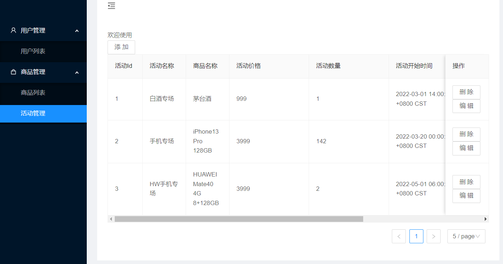

# README

这是一个微服务-电商秒杀项目。

本项目是由4个服务组成：

web，负责鉴权、数据转换、分流

user_srv，负责用户和管理员的注册与登陆

product_srv，负责商品和秒杀活动的增删改查

seckill_srv，负责用户订单的处理

详细见[开发文档-模块与关系](微服务电商秒杀平台--开发文档.md)

## 如何运行

确保已经安装并正确配置consul，redis，rabbitmq，mysql与相关依赖

运行consul集群

```bash
consul agent -dev
```

运行各个服务

```go
go run main.go
```

各个服务会根据自己的配置文件注册节点、连接数据库，创建消息队列等。

## 前端界面

前端界面需自行设计，此处仅为演示


