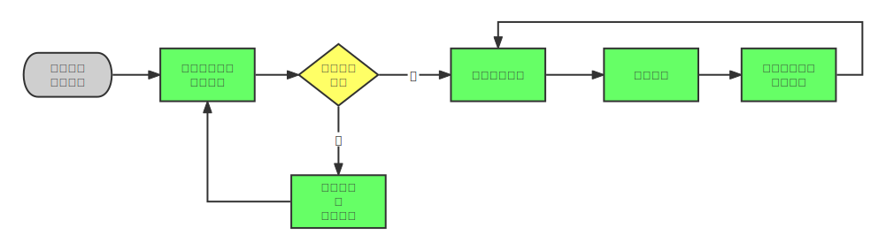
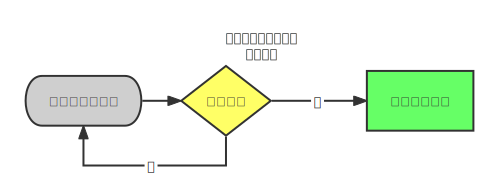
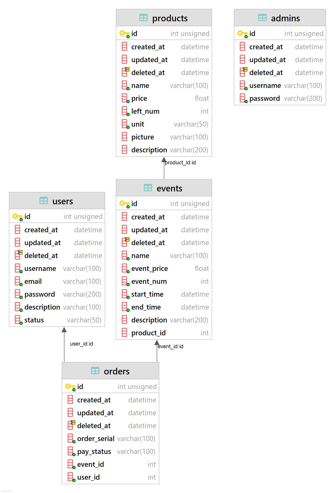
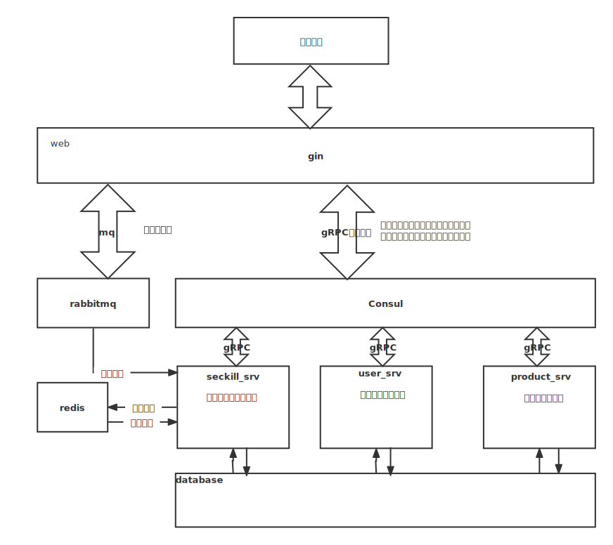
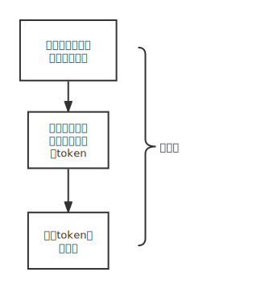
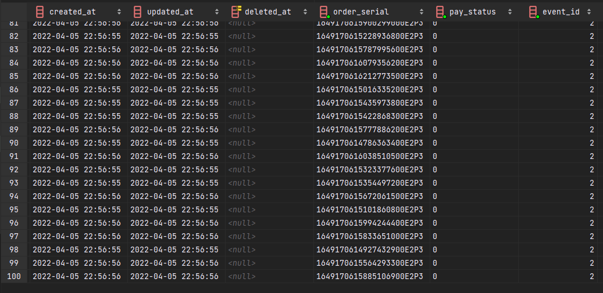
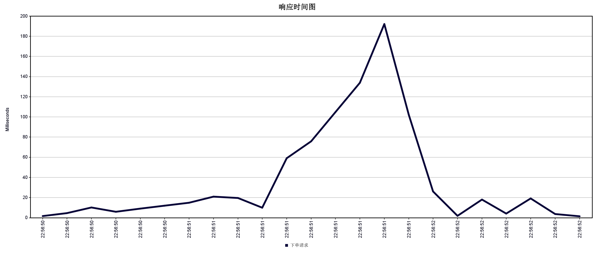
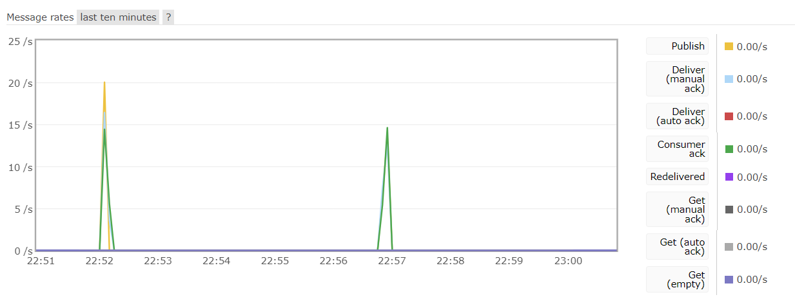
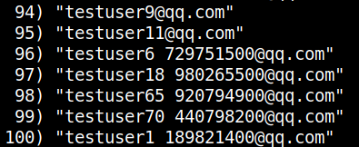

# 微服务电商秒杀平台--开发文档

[TOC]

## 开发环境与工具

* 平台：Windows 11 21H2 22000.556
* 工具：Goland 2021.2.3
* 环境：Go SDK 1.14，go-micro 0.11.1(on Windows11)，consul 1.8.3(on Windows11)，rabbitmq 3.9.13(on Windows11)，mysql 5.6(on Linux5.4.0Ubuntu)，redis 5.0.7(on Linux5.4.0Ubuntu)，

## 需求文档

### **后台管理**

* 管理员登陆
  * 账号与密码验证

---以下功能需要登陆后才能进行操作---

* 显示与管理用户列表
  * 显示账号信息（账号名称，描述，状态，创建时间）和进行相关操作
* 显示与管理商品列表
  * 添加商品，编辑商品，删除商品，显示商品信息（商品ID，名称，价格，数量，单位，图片，创建时间）
* 显示与管理活动列表
  * 添加活动，编辑活动，删除活动，显示活动信息（活动名称，活动价格，活动数量，开始时间，结束时间）

### **用户操作**

* 用户登陆与注册
  * 账号与密码验证
  * 注册时邮箱验证码
    * 验证码有效时间10分钟
* 查看商品列表
  * 商品图片，商品原价，商品名称，秒杀价格

---以下功能需要登陆后才能进行操作---

* 查看商品详细信息
  * 商品图片，商品原价，商品名称，秒杀价格，库存，抢购时间，抢购倒计时
* 商品下单
  * 针对多用户同时下单处理，保证不漏不多订单
  * 抢购限制：必须在活动时间内，一个用户在一个活动内只能下单一次

### 流程图

**用户操作流程**

**管理员操作流程**

### 数据库表设计

**users**

说明：存放用户信息

| 列名                                      | 数据类型        | 其他描述    |
| ----------------------------------------- | --------------- | ----------- |
| gorm.Model(ID CreateAt DeleteAt UpdateAt) | -               | -           |
| Username                                  | string,not null | 用户名      |
| Email                                     | string,not null | 邮箱        |
| Password                                  | string,not null | md5加密存放 |
| Description                               | string          |             |
| Status                                    | int,not null    | 用户状态    |

**admins**

说明：存放管理员信息

| 列名                                      | 数据类型        | 其他描述 |
| ----------------------------------------- | --------------- | -------- |
| gorm.Model(ID CreateAt DeleteAt UpdateAt) | -               | -        |
| Username                                  | string,not null | 用户名   |
| Password                                  | string,not null | 密码     |

**products**

说明：存放商品信息

| 列名                                      | 数据类型        | 其他描述 |
| ----------------------------------------- | --------------- | -------- |
| gorm.Model(ID CreateAt DeleteAt UpdateAt) | -               | -        |
| Name                                      | string,not null | 商品名   |
| Price                                     | float,not null  | 价格     |
| LeftNum                                   | int,not null    | 剩余数量 |
| Unit                                      | string,not null | 商品单位 |
| Picture                                   | string          | 商品图片 |
| Description                               | string          | 商品描述 |

**events**

说明：存放秒杀活动信息

| 列名                                      | 数据类型        | 其他描述                       |
| ----------------------------------------- | --------------- | ------------------------------ |
| gorm.Model(ID CreateAt DeleteAt UpdateAt) | -               | -                              |
| Name                                      | string,not null | 活动名                         |
| EventPrice                                | float,not null  | 秒杀价格                       |
| EventNum                                  | int,not null    | 参与活动数量，小于商品剩余数量 |
| StartTime                                 | time,not null   | 开始时间                       |
| EndTime                                   | time,not null   | 结束时间                       |
| Description                               | string          | 活动描述                       |
| ProductId                                 | int,not null    | 商品外键                       |

**orders**

说明：存放订单信息

| 列名                                      | 数据类型 | 其他描述 |
| ----------------------------------------- | -------- | -------- |
| gorm.Model(ID CreateAt DeleteAt UpdateAt) | -        | -        |
| OrderNum                                  | string   | 订单号   |
| UserId                                    | int      | 用户外键 |
| EventId                                   | int      | 事件外键 |
| PayStatus                                 | int      | 支付状态 |

## 模块与关系

使用go-micro微服务框架，注册4个服务在consul节点上：

1. web：
   * 使用gin作为路由，进行权限控制（token）、数据格式验证与转换、使用grpc调用注册在consul服务
   * 将下订单请求存入rabbitmq消息队列进行流量削峰
   * 读取redis里的请求下订单的结果并返回结果
2. user_srv：
   * 用户与管理员登陆服务，查询数据库里的`users`和`admins`表，返回是否验证成功
   * 用户注册服务，通过beego发送验证码邮件，校验验证码与用户信息写入
   * 用户信息查询服务：查询数据库里的`users`和`admins`表，返回用户信息供管理员查看
3. product_srv：
   * 添加产品服务，将管理员给到的商品信息写入`products`表
   * 产品信息查询服务：查询数据库里的`products`表，返回商品信息供管理员或用户查看
   * 产品信息编辑服务：将管理员给到的新的商品信息更新`products`表
4. seckill_srv：
   * 添加活动服务，将管理员给到的活动信息写入`events`表
   * 活动信息查询服务：查询数据库里的`events`表，返回活动信息供管理员或用户查看
   * 活动信息编辑服务：将管理员给到的新的活动信息更新`events`表
   * 创建订单服务：从rabbitmq里取出创建订单请求，验证是否符合下订单条件并创建订单写入`orders`表
   * 返回结果服务：根据创建订单结果存入redis供查询订单结果时使用

## 网络接口文档

点击[接口文档](秒杀项目后端接口文档.md)进行阅读

或点击[在线阅读接口文档](https://docs.apipost.cn/preview/a3b6090875ba0f44/3116509d69e68b9c)

## 通信接口文档

本项目使用proto文件进行rpc的消息定义，参见各目录的proto文件

## 性能分析

### 测试机器与环境

**四个服务**（web，user_srv，product_srv，seckill_srv）与**consul节点**与**rabbitmq**均运行在<u>本地开发机器</u>，配置如下：

处理器	Intel(R) Core(TM) i5-8250U CPU @ 1.60GHz   1.80 GHz
机带 RAM	8.00 GB
系统类型	Windows11 64 位操作系统, 基于 x64 的处理器

**redis**与**mysql**均运行在<u>云服务器</u>，配置如下：

处理器	2核 Intel(R) Xeon(R) Platinum 8255C CPU @ 2.50GHz @2.5GHz
RAM	4GB
带宽	8Mbps
系统类型	Ubuntu

### 测试方法

使用JMeter压测工具，使用100个线程模拟100个用户登陆、下单。流程文件见[压测流程](../test_full_process.jmx)。流程图如下：

### 测试结果

进行了两次测试，100个用户同时进行下单请求，如下`orders`表，最终都成功了下订单，没有多也没有少，承接住了100的并发。

---

响应时间图如下，可以看到最高响应延迟为195ms，由Jmeter的数据可以知道吞吐量为43.16，平均发送数据速率18.8Kb/s，平均接收数据速率 19.34KB/s。

| 43.15926 | 18.8 | 19.34 |
| -------- | ---- | ----- |
|          |      |       |

---

rabbitmq的消息没有堆积，环境设置了rabbitmq的Qos为10，web发送的消息速率最高达20个/s，下订单速率最高达15个/s。

---

下订单的结果存放在redis中，无一错漏，刚好100条。真实场景中客户端查询redis结果即可。

